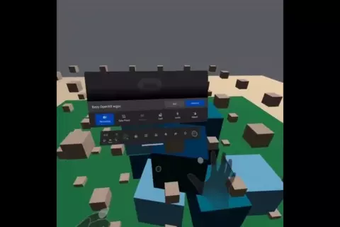

# Introduction

Proof-of-concept of getting [OpenXR](https://www.khronos.org/openxr/) rendering support for [Bevy](https://github.com/bevyengine/bevy) game engine using [gfx-rs](https://github.com/gfx-rs/gfx/) abstractions.



(hand interaction with boxes missing from current commit)

Targets:
1. Demonstrate that OpenXR rendering is possible on Rust/GFX-RS/Bevy -ecosystem
1. Start the discussion with ecosystem participants about proper way to implement OpenXR support for Rust
1. Eventually have the basic building blocks in an easy-to-use state for building XR apps on top of bevy, or implementing XR support for other rendering engines


For technical details, see [docs/architecture.md](docs/architecture.md):

<a href="docs/architecture.md"></a>
<a href="docs/architecture.md"></a><br />

Tracked pull requests at upstream:

* bevy: https://github.com/bevyengine/bevy/pull/2166
* wgpu-rs: https://github.com/gfx-rs/wgpu-rs/pull/910
* wgpu: https://github.com/gfx-rs/wgpu/pull/1387
* gfx-rs: https://github.com/gfx-rs/gfx/pull/3761
* bevy_rapier: https://github.com/dimforge/bevy_rapier/pull/69 (only required for kinematics in the example)
* android-ndk-rs: https://github.com/rust-windowing/android-ndk-rs/pull/138 (needed for bundling .so for Oculus Quest 2)

# Getting started

**Important - read before**:

1. Windows is not currently supported - support will be released soon
1. This has only been tested on Oculus Quest 2, but should also work on [Monado](https://monado.dev/) (on Linux)
1. These quideline steps below haven't been validated by anyone yet, so expect challenges on the way... (e.g. a few hours to get it compiling)

## Ubuntu packages

Prequisite installation:

    sudo apt-get install make openjdk-11-jre g++ libudev-dev libasound2-dev gcc libopenxr-loader1

TODO: document if all are really necessary...

## Download dependency crates & patch them

Currently this example depends on a lot of changes for multitude of crates that bevy depends on. To download & patch them (mostly paths instead of crates.io crates) for local building, run a make command. This will download repos to repos/ folder, and patch them with patch files in [patches/](./patches) folder (most changes are in repo-git source code though):

    make download_dependencies

## Prequisite Rust packages (optional)

For faster linking:

    sudo apt-get install lld


And add this to `~/.cargo/config`

    [target.x86_64-unknown-linux-gnu]
    rustflags = [
      "-C", "link-arg=-fuse-ld=lld",
    ]


# Building for Oculus Quest 2

## Prequisites

Currently a patched version of cargo-apk is required. Install it like this:

**NOTE! THIS WILL REPLACE PREVIOUSLY INSTALLED cargo-apk IN GLOBAL PATH!**

    cargo install --path repos/android-ndk-rs/cargo-apk

or

    install_cargo_apk

If you have not setup udev yet, copy udev rules for Oculus Quest 2

    # run both as root
    echo 'SUBSYSTEM=="usb", ATTR{idVendor}=="2833", ATTR{idProduct}=="0186", MODE="0660", GROUP="plugdev"' > /etc/udev/rules.d/51-android.rules
    udevadm control --reload-rules && udevadm trigger


## Oculus OpenXR plugin


You **must** download `libopenxr_loader.so` from [Oculus OpenXR Mobile SDK](https://developer.oculus.com/downloads/package/oculus-openxr-mobile-sdk/) file. It should be stored to `libs/aarch64-linux-android` folder. It is at path `OpenXR/Libs/Android/arm64-v8a/Release` in the zip file.

    $ ls -al libs/aarch64-linux-android/libopenxr_loader.so
    -rwxrwxr-x 1 user user 10639048 feb  13 14:46 libs/aarch64-linux-android/libopenxr_loader.so

    $ file libs/aarch64-linux-android/libopenxr_loader.so
    ELF 64-bit LSB shared object, ARM aarch64, version 1 (SYSV), dynamically linked, BuildID[sha1]=..., with debug_info, not stripped


## Android SDK

You need android SDK & NDK to build .apk.

Append to `.bashrc` (and change paths if versions have changed...)

    export ANDROID_SDK_ROOT="$HOME/Android/Sdk"
    export ANDROID_NDK_ROOT="$HOME/Android/Sdk/ndk/22.0.7026061"

Unzip https://developer.android.com/studio/command-line/sdkmanager to `$ANDROID_SDK_ROOT/cmdline-tools`

After that, install required sdk's:

    ./cmdline-tools/bin/sdkmanager --sdk_root=$ANDROID_SDK_ROOT "ndk;22.0.7026061"
    ./cmdline-tools/bin/sdkmanager --sdk_root=$ANDROID_SDK_ROOT "build-tools;30.0.3"
    ./cmdline-tools/bin/sdkmanager --sdk_root=$ANDROID_SDK_ROOT "platforms;android-30"
    ./cmdline-tools/bin/sdkmanager --sdk_root=$ANDROID_SDK_ROOT "platforms;android-29"

## Run the example

    cargo apk run --example xr_apk_scene --release

or

    make run_xr_apk

If successful, it should output something like this:

```
    Finished release [optimized] target(s) in 32.78s
 'lib/arm64-v8a/libxr_apk_scene.so'...
 'lib/arm64-v8a/libc++_shared.so'...
 'lib/arm64-v8a/libopenxr_loader.so'...
Verifying alignment of /.../Bevy OpenXR wgpu.apk (4)...
      49 AndroidManifest.xml (OK - compressed)
    1152 assets/textures/uv-small.png (OK)
  319920 lib/arm64-v8a/libxr_apk_scene.so (OK - compressed)
15689936 lib/arm64-v8a/libc++_shared.so (OK - compressed)
17515002 lib/arm64-v8a/libopenxr_loader.so (OK - compressed)
Verification succesful
Performing Incremental Install
Serving...
Unknown command: install-incremental
Performing Streamed Install
Success
Starting: Intent { act=android.intent.action.MAIN cmp=rust.example.xr_apk_scene/android.app.NativeActivity }
```

# Building for PC

## Monado

(this example has been undocumented, please make a pull request to improve)

https://monado.freedesktop.org/packages-ubuntu.html

    sudo add-apt-repository ppa:monado-xr/monado
    sudo apt-get update
    sudo apt-get install libopenxr-loader1 libopenxr1-monado

See Monado docs for using it.

## Run the example

    cargo run --example xr_pc_scene

or

    make run_xr_pc

(untested! please make a pull req if this works - it should be working though)

# Patched dependencies

See pull requests above. Also:

## openxrs

* branched from `63e80e30b0d37a4203fc103978cd146edb89f2dc` (Dec 17), because the vulkan2 change is currently incompatible
* added a few changes in order to handle Oculus Quest 2 case

## android-ndk-rs

* branched from `fe3576c8d8a5b54f09475dcb0bb530e56df60eb1` (Jan 31), but can be updated to latest
* added a lib path search for copying .so files into APK (needed for Quest 2 openxr loader)
* similar feature already waiting for merge at https://github.com/rust-windowing/android-ndk-rs/pull/138 - this patch can be removed after
* compare: https://github.com/rust-windowing/android-ndk-rs/compare/master...blaind:bevy_openxr

# Related material

Further reading - some links that have helped in getting this PoC working:

* https://www.khronos.org/registry/OpenXR/specs/1.0/html/xrspec.html
* https://github.com/Ralith/openxrs/blob/master/openxr/examples/vulkan.rs
* https://github.com/GodotVR/godot_openxr

# Troubleshooting

## OpenXR loader not found

```
Settings: ()
thread 'main' panicked at 'called `Result::unwrap()` on an `Err` value: XRLoad(DlOpen { desc: "libopenxr_loader.so: cannot open shared object file: No such file or directory" })', repos/bevy_openxr/crates/bevy_openxr/src/platform/mod.rs:44:55
note: run with `RUST_BACKTRACE=1` environment variable to display a backtrace
```

* On Ubuntu, `apt-get install libopenxr-loader1`
* On Windows, [todo]